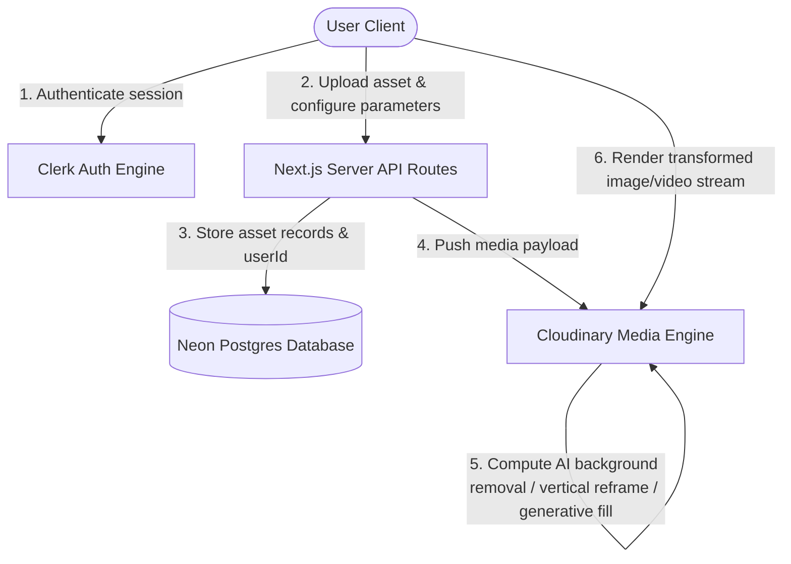

# AI Media Workbench (SaaS Platform)

A full-stack media management and transformation platform. Built with Next.js (App Router), Neon PostgreSQL, Prisma, Clerk, and Cloudinary to handle user-isolated image editing and video optimization.

---

## 🏗️ System Architecture



---

## ⚡ Core Capabilities

*   **🔒 Multi-User Isolation:** Complete workspace isolation. Media assets, uploads, and search queries are strictly partitioned by authenticated Clerk User IDs.
*   **📷 AI Image Workspace (Social Share):**
    *   **Preset Aspect Resizing:** Dynamic cropping for Instagram (1:1, 4:5), Twitter (16:9, 3:1), and Facebook (205:78) using AI content-aware focus (`gravity: "auto"`).
    *   **AI Background Removal:** Toggle background removal on/off instantly.
    *   **AI Background Replace:** Swap the background using natural language prompts.
    *   **AI Object Replacement:** Swap specific objects in the frame using text replacement instructions (e.g. swap a cup for a bottle).
    *   **Library Gallery:** Automatically saves uploads to a history list. Click any thumbnail to reload it into the editor or delete it.
*   **🎥 Video Optimization & Previews:**
    *   **Determinate Progress Tracking:** Live upload percentage indicator powered by Axios request hooks.
    *   **Auto-Compression:** Cloudinary trans-coding translates raw uploads into optimized streamable MP4s.
    *   **Hover Highlights:** Hovering a video card generates a 15-second loop preview (`e_preview` transform).
    *   **On-Site Player:** Built-in modal playback overlay with controls.
    *   **AI Video Re-framing:** Action menu to download the video in 9:16 vertical format (TikTok/Shorts crop) with automatic object tracking.
*   **🔍 Smart Search:** Instant client-side search query input filtering video titles/descriptions and image identifiers.
*   **🗑️ Account Purge:** Permanent account removal sequence that wipes PostgreSQL data rows, destroys files on Cloudinary, and deletes the user profile in Clerk.

---

https://ai-saas-phi-wheat.vercel.app/

## 🛠️ Project Stack

*   **Framework:** Next.js (App Router, Turbopack)
*   **ORM:** Prisma
*   **Database:** Neon (Serverless PostgreSQL)
*   **Media Processing:** Cloudinary SDK
*   **Authentication:** Clerk
*   **CSS Framework:** TailwindCSS & DaisyUI

---

## ⚙️ Environment Variables

Create a `.env.local` file at the root of the project:

```env
# Database Connection
DATABASE_URL="postgresql://<username>:<password>@<host>/<database>?sslmode=require"

# Cloudinary Integration
NEXT_PUBLIC_CLOUDINARY_CLOUD_NAME="your-cloud-name"
CLOUDINARY_API_KEY="your-api-key"
CLOUDINARY_API_SECRET="your-api-secret"

# Clerk Config
NEXT_PUBLIC_CLERK_PUBLISHABLE_KEY="pk_test_..."
CLERK_SECRET_KEY="sk_test_..."
NEXT_PUBLIC_CLERK_SIGN_IN_URL="/sign-in"
NEXT_PUBLIC_CLERK_SIGN_UP_URL="/sign-up"
```

---

## 🚀 Setup & Execution

### 1. Install Dependencies
```bash
npm install
```

### 2. Database Setup & Sync
Generate the Prisma types and apply schema migrations:
```bash
npx prisma generate
npx prisma migrate dev
```

### 3. Run Dev Server
```bash
npm run dev
```
Open `http://localhost:3000` to interact with the project.
